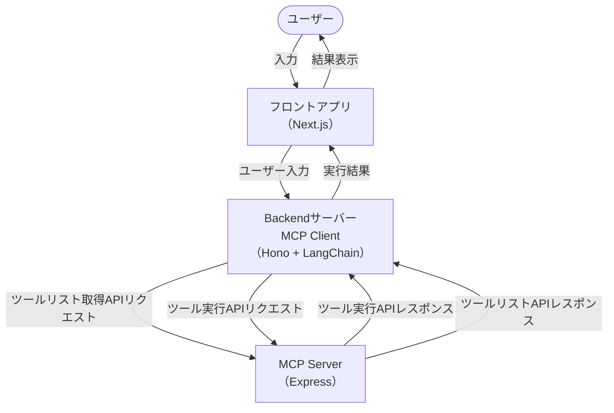

```mermaid
flowchart TD
    User(["ユーザー"])
    Front[フロントアプリ<br/>（Next.js）]
    Hono[Backendサーバー <br> MCP Client<br/>（Hono + LangChain）]
    Express[MCP Server<br/>（Express）]

    User -- 入力 --> Front
    Front -- ユーザー入力 --> Hono
    Hono -- ツールリスト取得APIリクエスト --> Express
    Hono -- ツール実行APIリクエスト --> Express
    Express -- ツール実行APIレスポンス --> Hono
    Express -- ツールリストAPIレスポンス --> Hono
    Hono -- 実行結果 --> Front
    Front -- 結果表示 --> User
```